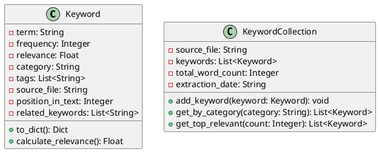
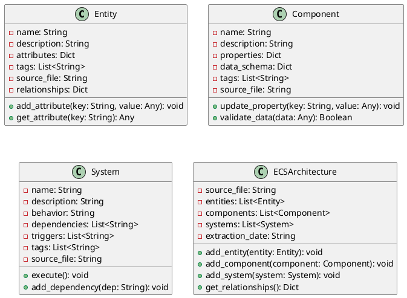
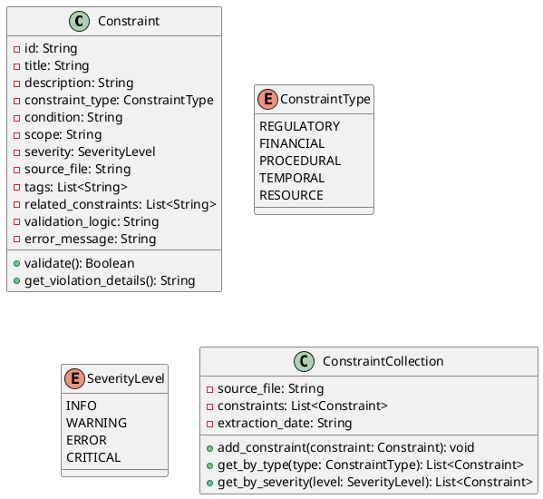
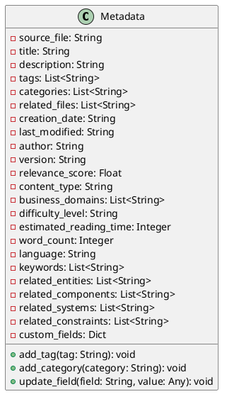
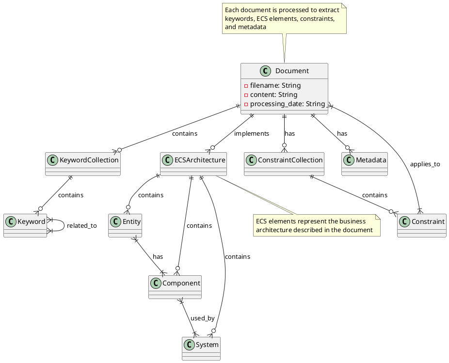
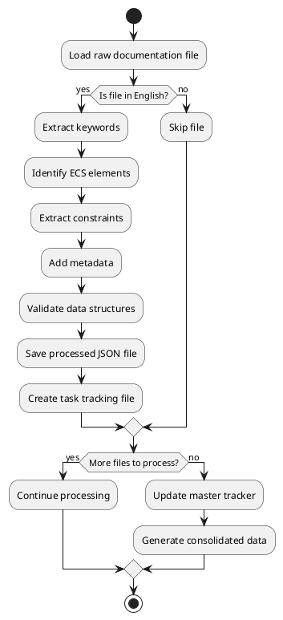
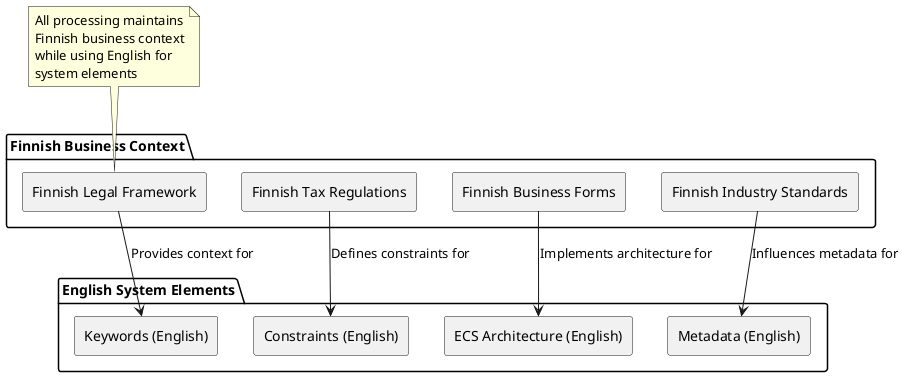

# Dataset Documentation: Finnish Business Operations Repository

## Overview

This documentation provides a comprehensive overview of the Finnish Business Operations Repository dataset, which contains English documentation files with processed business information including keywords, ECS elements, constraints, and metadata.

## Table of Contents

1. [Dataset Structure](#dataset-structure)
2. [Data Models](#data-models)
3. [Relationships](#relationships)
4. [Processing Pipeline](#processing-pipeline)
5. [Business Context](#business-context)
6. [Usage Guidelines](#usage-guidelines)

## Dataset Structure

The dataset consists of processed documentation files that contain structured business information. Each document has been enhanced with:

- Keywords with relevance scores and categories
- ECS elements (Entities, Components, Systems)
- Constraints with types and severity levels
- Comprehensive metadata for search optimization

```plantuml
@startuml
package "Finnish Business Operations Repository" {
  folder "docs" as docs {
    note bottom : Contains original documentation files
  }
  
  folder "processed_docs" as proc {
    note bottom : Contains processed JSON files with enhanced data
  }
  
  folder "plan" as plan {
    folder "manual_processing" as mp {
      folder "tasks" as tasks {
        note bottom : Individual processing task files
      }
      file "master_tracker.md" as tracker {
        note bottom : Tracks overall processing progress
      }
    }
  }
  
  folder "src" as src {
    note bottom : Source code for processing scripts
  }
  
  docs --> proc : "processed to"
  tasks --> proc : "tracks processing of"
  tracker --> proc : "monitors progress of"
  src --> proc : "generates"
}
@enduml
```

## Data Models

The dataset uses several core data models to structure business information:

### Keyword Model

Keywords are extracted business terms with relevance scores and categories.



### ECS Architecture Model

The ECS (Entity-Component-System) model represents business architecture elements.



### Constraint Model

Constraints represent regulatory, financial, procedural, and other business limitations.



### Metadata Model

Metadata provides search-engine optimization and business domain information.



## Relationships

The dataset elements are interconnected through various relationships:



## Processing Pipeline

The following diagram shows the processing pipeline used to transform raw documentation files into structured data:



## Business Context

The dataset maintains Finnish business context while using English for system elements:



## Usage Guidelines

The processed dataset can be used for:

- Search and retrieval of business information
- Automated compliance checking
- Business process modeling
- Knowledge graph construction
- Business intelligence applications

For more information on how to use the dataset, refer to the individual processed files in the `processed_docs` directory.