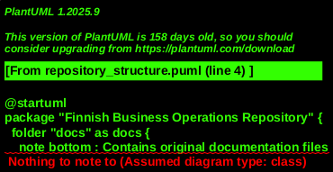
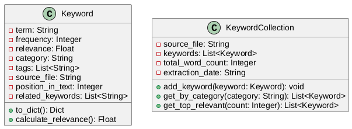
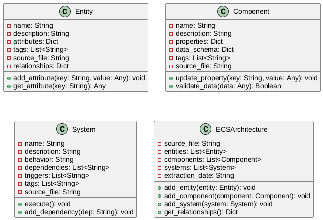
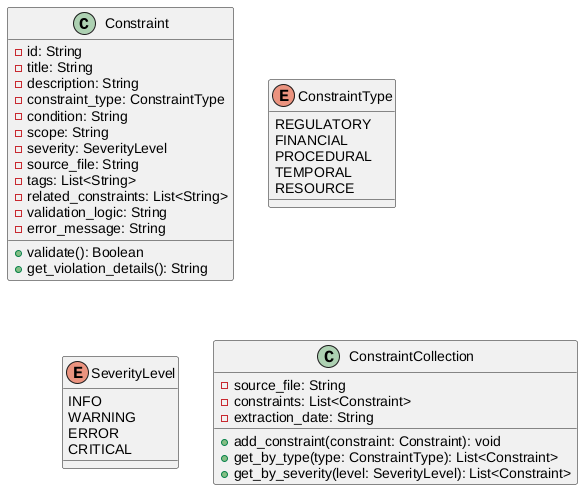
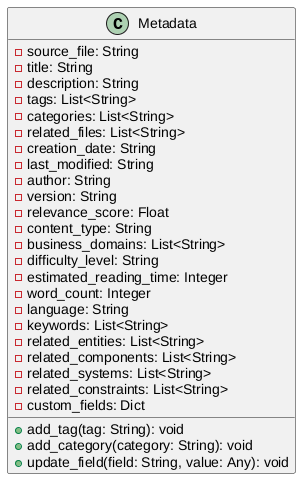
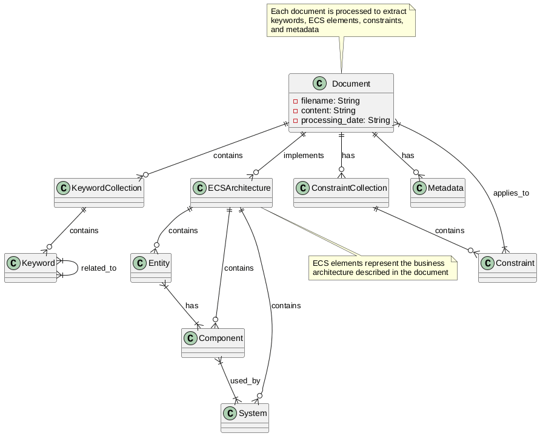
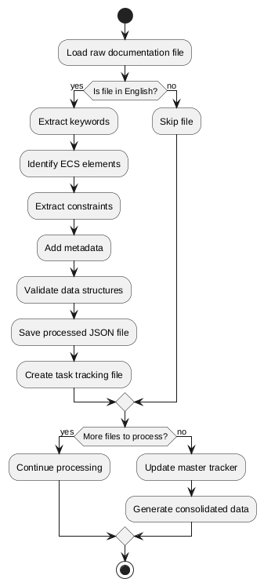
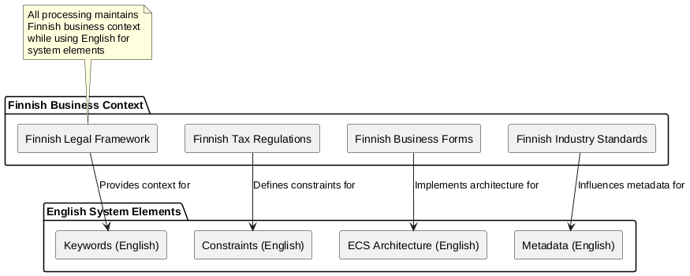

# Finnish Business Operations Repository - Dataset Documentation

## Overview

Welcome to the comprehensive documentation for the Finnish Business Operations Repository dataset. This repository contains processed English documentation files from Finnish business operations, enhanced with keywords, ECS elements, constraints, and metadata.

### Purpose

The Finnish Business Operations Repository is designed to provide structured business information that combines Finnish business context with English system elements. This enables:

- Efficient search and retrieval of business information
- Automated compliance checking
- Business process modeling
- Knowledge graph construction
- Business intelligence applications

### Structure

The repository is organized as follows:



## Data Models

The dataset uses several core data models to structure business information:

### Keyword Model

Keywords are extracted business terms with relevance scores and categories.



### ECS Architecture Model

The ECS (Entity-Component-System) model represents business architecture elements.



### Constraint Model

Constraints represent regulatory, financial, procedural, and other business limitations.



### Metadata Model

Metadata provides search-engine optimization and business domain information.



## Relationships

The dataset elements are interconnected through various relationships:



## Processing Pipeline

The following diagram shows the processing pipeline used to transform raw documentation files into structured data:



## Business Context

The dataset maintains Finnish business context while using English for system elements:



## Usage Guidelines

The processed dataset can be used for:

- Search and retrieval of business information
- Automated compliance checking
- Business process modeling
- Knowledge graph construction
- Business intelligence applications

### Accessing Processed Data

Each processed document is available in the `processed_docs` directory as a JSON file containing:

1. **Original Content**: The full text of the original document
2. **Keywords**: Extracted business terms with relevance scores
3. **ECS Elements**: Entities, Components, and Systems representing business architecture
4. **Constraints**: Regulatory, financial, procedural, and other business constraints
5. **Metadata**: Search-engine optimization metadata and business domain tags

### Example Usage

```python
import json

# Load a processed document
with open('processed_docs/example_document_processed.json', 'r') as f:
    data = json.load(f)

# Access keywords
keywords = data['keywords']
for keyword in keywords:
    print(f"Term: {keyword['term']}, Relevance: {keyword['relevance']}")

# Access ECS elements
ecs_elements = data['ecs_elements']
entities = ecs_elements['entities']
components = ecs_elements['components']
systems = ecs_elements['systems']

# Access constraints
constraints = data['constraints']
for constraint in constraints:
    print(f"Constraint: {constraint['title']}, Type: {constraint['constraint_type']}")

# Access metadata
metadata = data['metadata']
print(f"Title: {metadata['title']}")
print(f"Categories: {metadata['categories']}")
```

## Quality Assurance

All processed files undergo validation to ensure:

- Proper data structure formatting
- Correct relationships between elements
- Accurate metadata capture
- Cross-references with other documents

## Contributing

To contribute to this dataset:

1. Add new documentation files to the `docs` directory
2. Run the processing scripts in the `src` directory
3. Update the master tracker in `plan/manual_processing/master_tracker.md`
4. Create individual task files in `plan/manual_processing/tasks`

## License

This dataset is provided under the terms specified in the LICENSE file in the repository root.

## Contact

For questions about this dataset, please contact the maintainers through the project's issue tracker.